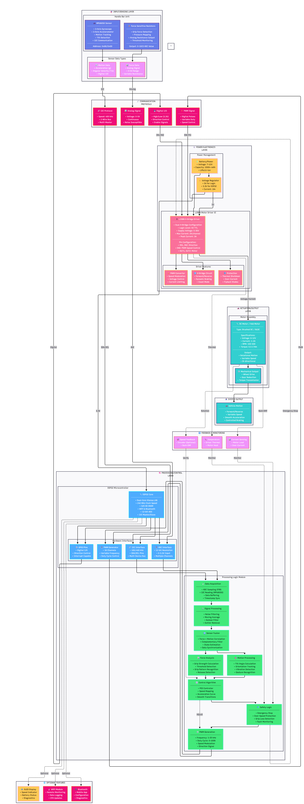
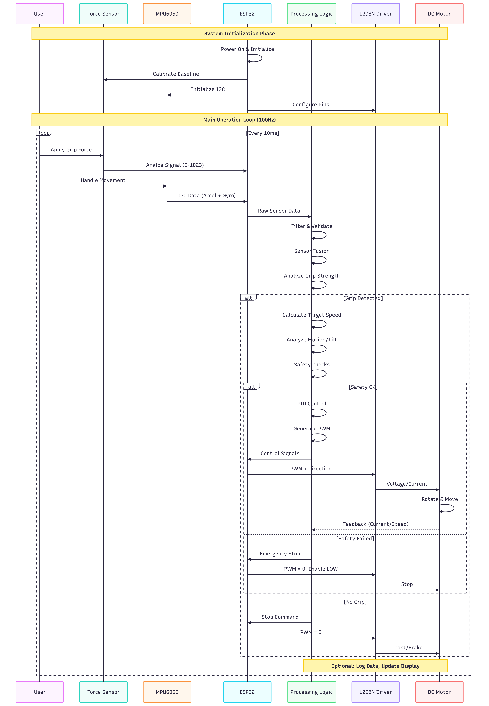
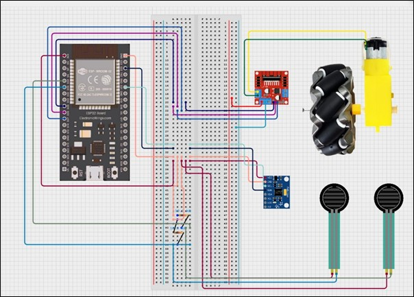

# GripSense 🖐️
### Intelligent Grip & Motion-Aware Motor Safety System

GripSense is an embedded IoT system that intelligently combines **grip pressure sensing** and **motion analysis** to dynamically control motor speed in real time.  
The system is designed to improve **safety, stability, and control** in human–machine interaction scenarios.

---

## 🚩 Problem Statement
Many motor-driven systems fail to understand:
- How firmly a user is gripping a device
- Whether sudden or unsafe motion is occurring

This can lead to:
- Mechanical damage
- Unsafe operation
- Loss of user control

---

## 💡 Solution
GripSense fuses data from:
- **Force Sensitive Resistors (FSR)** for grip pressure
- **MPU6050 gyroscope** for motion detection

Using intelligent rule-based logic, the system:
- Reduces motor speed during unsafe grip or motion
- Gradually stops the motor during sustained danger
- Restores speed safely when conditions normalize

---

## 🧠 Key Features
- Real-time grip pressure normalization
- Motion classification using sliding window averaging
- Pattern-based danger detection
- Gentle acceleration and deceleration
- Embedded safety-first decision logic

---

## 🏗️ System Architecture

---

## 🔄 System Flow

---

## 🔌 Circuit Diagram

---

## ▶️ Watch Full Demo Video:
https://drive.google.com/file/d/1elsRZMTPvooa_Qo_aMxw_2bkWMY5SjzO/view

---

## 🛠️ Tech Stack
- ESP32
- Force Sensitive Resistors (FSR)
- MPU6050 (Gyroscope)
- L298N Motor Driver
- Embedded C / Arduino Framework

---

## 🚀 Future Enhancements
- Machine learning based grip classification
- Cloud data logging & analytics
- Prosthetic and robotic system integration
- Mobile dashboard via BLE / Wi-Fi

---

## 📜 License
MIT License
